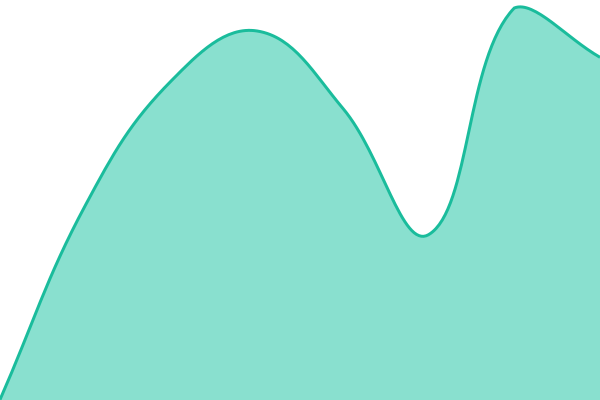
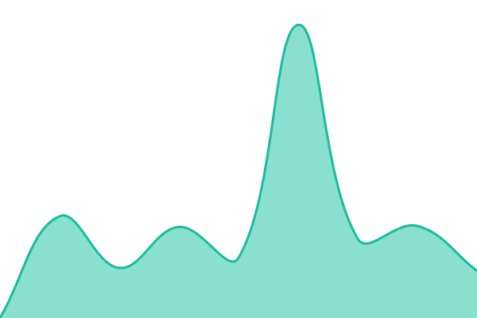
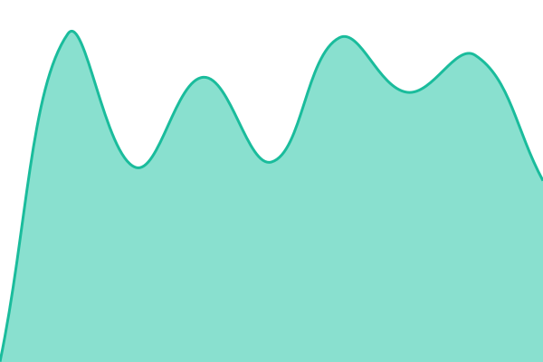

# [📈 Live Status](https://desisn.github.io/upptime/): <!--live status--> **🟩 All systems operational**

This repository contains the open-source uptime monitor and status page for [Upptime](https://upptime.js.org), powered by [Upptime](https://github.com/upptime/upptime).

With [Upptime](https://upptime.js.org), you can get your own unlimited and free uptime monitor and status page, powered entirely by a GitHub repository. We use [Issues](https://github.com/upptime/upptime/issues) as incident reports, [Actions](https://github.com/desisn/upptime/actions) as uptime monitors, and [Pages](https://demo.upptime.js.org) for the status page.

<!--start: status pages-->
<!-- This summary is generated by Upptime (https://github.com/upptime/upptime) -->
<!-- Do not edit this manually, your changes will be overwritten -->
<!-- prettier-ignore -->
| URL | Status | History | Response Time | Uptime |
| --- | ------ | ------- | ------------- | ------ |
|  [desisn.de](https://desisn.de) | 🟩 Up | [desisn-de.yml](https://github.com/desisn/upptime/commits/HEAD/history/desisn-de.yml) | 

 896ms
     
 | 

<a href="https://desisn.github.io/upptime/history/desisn-de">100.00%</a>
    

|  [dico-mediadesign.de](https://dico-mediadesign.de) | 🟩 Up | [dico-mediadesign-de.yml](https://github.com/desisn/upptime/commits/HEAD/history/dico-mediadesign-de.yml) | 

 1353ms
     
 | 

<a href="https://desisn.github.io/upptime/history/dico-mediadesign-de">99.26%</a>
    

|  [seanlina.com](https://seanlina.com) | 🟩 Up | [seanlina-com.yml](https://github.com/desisn/upptime/commits/HEAD/history/seanlina-com.yml) | 

 3481ms
     
 | 

<a href="https://desisn.github.io/upptime/history/seanlina-com">99.36%</a>
    

|  [bchirg.de](https://bchirg.de) | 🟩 Up | [bchirg-de.yml](https://github.com/desisn/upptime/commits/HEAD/history/bchirg-de.yml) | 

 1996ms
     
 | 

<a href="https://desisn.github.io/upptime/history/bchirg-de">100.00%</a>
    

|  [tips4.app](https://tips4.app) | 🟩 Up | [tips4-app.yml](https://github.com/desisn/upptime/commits/HEAD/history/tips4-app.yml) | 

 736ms
     
 | 

<a href="https://desisn.github.io/upptime/history/tips4-app">100.00%</a>
    

|  [hannovers-steuerberater.de](https://hannovers-steuerberater.de) | 🟩 Up | [hannovers-steuerberater-de.yml](https://github.com/desisn/upptime/commits/HEAD/history/hannovers-steuerberater-de.yml) | 

 873ms
     
 | 

<a href="https://desisn.github.io/upptime/history/hannovers-steuerberater-de">99.45%</a>
    

|  [heise.de](https://heise.de) | 🟩 Up | [heise-de.yml](https://github.com/desisn/upptime/commits/HEAD/history/heise-de.yml) | 

 2899ms
     
 | 

<a href="https://desisn.github.io/upptime/history/heise-de">100.00%</a>
    

<!--end: status pages-->

[**Visit our status website →**](https://desisn.github.io/upptime/)

## 📄 License

- Powered by: [Upptime](https://github.com/upptime/upptime)
- Code: [MIT](./LICENSE) © [Upptime](https://upptime.js.org)
- Data in the `./history` directory: [Open Database License](https://opendatacommons.org/licenses/odbl/1-0/)
